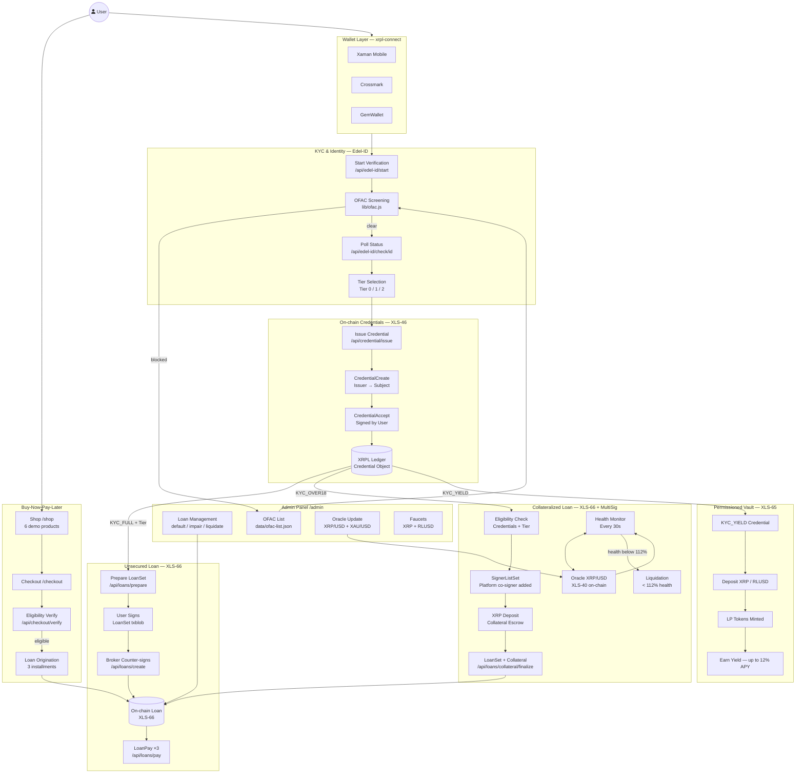
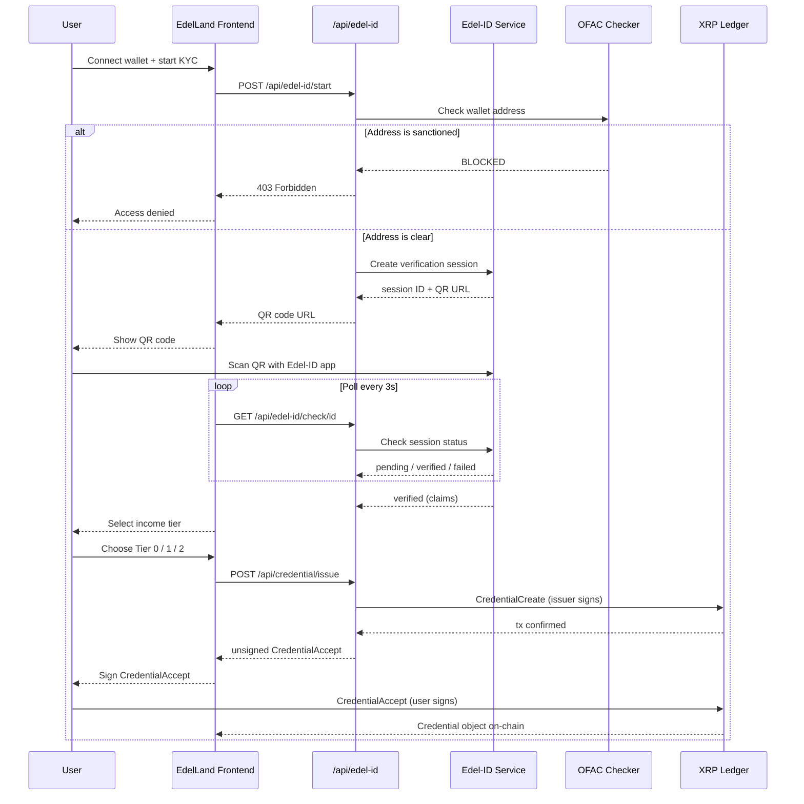
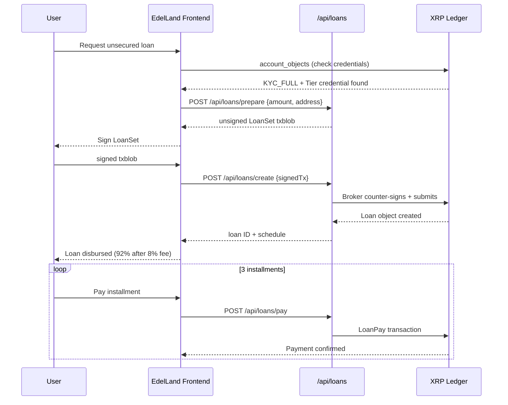
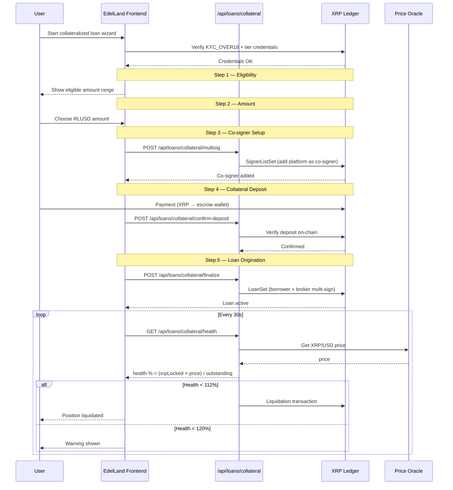
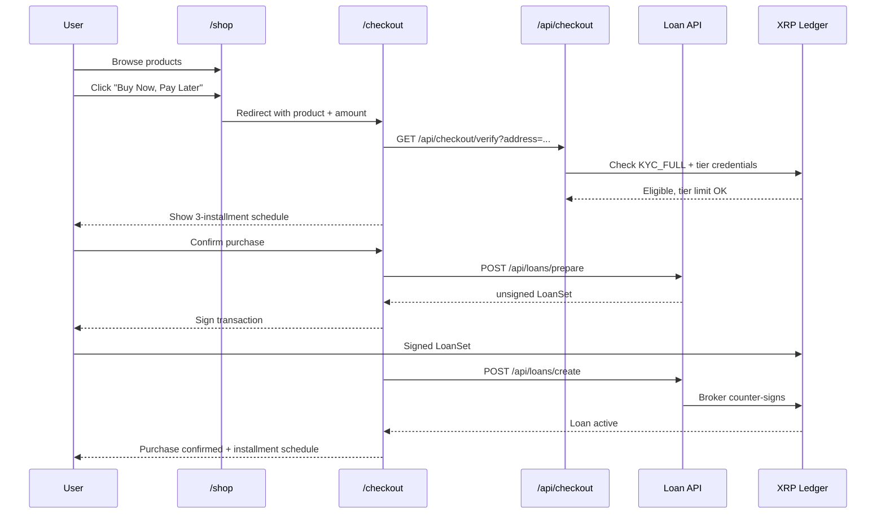

# EdelLand BSA

> **KYC-gated lending platform on the XRP Ledger** — Buy-Now-Pay-Later, collateralized loans, permissioned yield vaults, and on-chain identity credentials. All non-custodial, all compliant.

---

## Table of Contents

1. [Overview](#overview)
2. [Architecture Diagram](#architecture-diagram)
3. [Flow Diagrams](#flow-diagrams)
4. [Feature Overview](#feature-overview)
5. [Tech Stack](#tech-stack)
6. [Project Structure](#project-structure)
7. [Getting Started](#getting-started)
8. [Environment Variables](#environment-variables)
9. [Pages & Routes](#pages--routes)
10. [API Reference](#api-reference)
11. [XRPL Protocol Features](#xrpl-protocol-features)
12. [KYC & Credential System](#kyc--credential-system)
13. [Lending Protocol](#lending-protocol)
14. [Collateral System](#collateral-system)
15. [Permissioned Vault](#permissioned-vault)
16. [Admin Panel](#admin-panel)
17. [Scripts & Setup](#scripts--setup)
18. [Security & Compliance](#security--compliance)

---

## Overview

EdelLand is a **decentralized credit platform** built on the XRP Ledger that bridges real-world identity verification with on-chain financial primitives. It leverages:

- **Edel-ID** — Swiss identity verification provider for KYC
- **XLS-46** — XRPL on-chain verifiable credentials
- **XLS-66** — XRPL native lending protocol
- **xrpl-connect** — Multi-wallet abstraction (Xaman, Crossmark, GemWallet)

Users prove their identity once, receive tiered on-chain credentials, and can immediately access credit lines, BNPL checkout flows, or earn yield in permissioned vaults — all without ever surrendering custody of their funds.

---

## Architecture Diagram



---

## Flow Diagrams

### KYC Verification Flow



### Unsecured Loan Flow



### Collateralized Loan Flow



### BNPL Checkout Flow



---

## Feature Overview

| Feature | Description | Protocol |
|---|---|---|
| **Identity Verification** | KYC via Edel-ID (Swiss provider), claims-based | Edel-ID API |
| **On-chain Credentials** | Verifiable credentials stored on XRPL per user | XLS-46 |
| **Unsecured Loans** | Credit lines backed by KYC tier, no collateral | XLS-66 |
| **Collateralized Loans** | XRP-backed loans with real-time health monitoring | XLS-66 + MultiSig |
| **Buy-Now-Pay-Later** | Shop checkout with automatic 3-installment loan | XLS-66 |
| **Permissioned Vault** | Earn yield on deposited assets (KYC_YIELD gated) | XLS-65 |
| **OFAC/AML Screening** | Automatic sanctions check before KYC completion | Custom |
| **Multi-wallet Support** | Xaman, Crossmark, GemWallet via xrpl-connect | xrpl-connect |
| **Price Oracle** | On-chain XRP/USD + XAU/USD feeds | XLS-40 |
| **Admin Panel** | Loan management, oracle updates, faucets | Internal |

---

## Tech Stack

| Layer | Technology |
|---|---|
| Framework | Next.js 14 (App Router) |
| UI | React 18 + Tailwind CSS 3.4 |
| Blockchain Client | xrpl.js 4.6.0 |
| Wallet Abstraction | xrpl-connect 0.6.0 |
| Identity | Edel-ID API (Swiss KYC) |
| Monorepo | Turborepo + pnpm workspaces |
| Storage | File-backed JSON (collateral, OFAC) |
| Node | >= 18.0.0 |
| Package Manager | pnpm >= 8.0.0 |

---

## Project Structure

```
edelland-bsa/
├── apps/
│   └── web/                             # Next.js application
│       ├── app/
│       │   ├── page.js                  # Landing page
│       │   ├── layout.js                # Root layout + WalletProvider
│       │   ├── globals.css              # Dark glass theme
│       │   ├── account/                 # User dashboard
│       │   ├── loans/                   # Loans management + new wizard
│       │   ├── onboarding/              # KYC verification flow
│       │   ├── yield/                   # Permissioned vault
│       │   ├── shop/                    # E-commerce (BNPL demo)
│       │   ├── checkout/                # Checkout + loan origination
│       │   ├── admin/                   # Admin panel
│       │   └── api/
│       │       ├── credential/          # Credential issuance
│       │       ├── edel-id/             # Edel-ID integration
│       │       ├── loans/               # Loan lifecycle
│       │       │   └── collateral/      # Collateral sub-routes
│       │       ├── account/             # Account queries
│       │       ├── admin/               # Admin operations
│       │       ├── cron/                # Background jobs
│       │       ├── vault/               # Vault queries
│       │       └── xrpl/                # XRPL RPC proxy
│       ├── components/
│       │   ├── providers/
│       │   │   └── WalletProvider.js    # Global wallet context
│       │   ├── Header.js
│       │   ├── EdelIDVerification.js    # KYC UI component
│       │   ├── CredentialReceive.js     # Credential issuance UI
│       │   └── ui/                      # Card, Button, Input, Badge…
│       ├── hooks/
│       │   ├── useWalletConnector.js
│       │   └── useWalletManager.js
│       ├── lib/
│       │   ├── networks.js              # AlphaNet / Testnet / Devnet
│       │   ├── collateral-store.js      # Persistent collateral positions
│       │   ├── ofac.js                  # AML sanctions list
│       │   └── utils.js
│       ├── data/
│       │   └── ofac-list.json
│       ├── scripts/
│       │   ├── setup/                   # Full platform init
│       │   └── lending-protocol/        # Loan demo scripts
│       └── .env.local.example
├── packages/                            # Shared packages (future)
├── turbo.json
├── pnpm-workspace.yaml
└── package.json
```

---

## Getting Started

### Prerequisites

- Node.js >= 18
- pnpm >= 8

### Installation

```bash
# Install dependencies
pnpm install

# Initialize the platform
# Generates wallets, deploys tokens, vault, oracle, writes .env.local
pnpm init:env

# Start development server
pnpm dev
```

The app runs at `http://localhost:3000`.

### Setup Flow

```
pnpm init:env
  ├── create-accounts.mjs          → issuer, broker, collateral, oracle wallets
  ├── setup-rlusd.mjs              → deploy RLUSD IOU token + trust lines
  ├── setup-credentials.mjs        → configure credential issuer on-chain
  ├── setup-oracle.mjs             → deploy XRP/USD + XAU/USD oracle feeds
  ├── setup-permissioned-vault.mjs → deploy yield vault (XLS-65)
  ├── faucet-rlusd.mjs             → fund test accounts
  └── env-writer.mjs               → write all values to .env.local
```

---

## Environment Variables

Copy `.env.local.example` to `.env.local`. Most values are auto-generated by `pnpm init:env`.

### Wallet Connection

```env
NEXT_PUBLIC_XAMAN_API_KEY=              # Xaman OAuth app ID
NEXT_PUBLIC_WALLETCONNECT_PROJECT_ID=   # WalletConnect Cloud project ID
```

### Platform Wallets (auto-generated)

```env
PLATFORM_ISSUER_WALLET_SEED=
PLATFORM_ISSUER_WALLET_ADDRESS=
PLATFORM_BROKER_WALLET_SEED=
NEXT_PUBLIC_PLATFORM_BROKER_WALLET_ADDRESS=
NEXT_PUBLIC_CREDENTIAL_ISSUER=
NEXT_PUBLIC_CREDENTIAL_TYPE=            # Default credential type hex
NEXT_PUBLIC_YIELD_CREDENTIAL_TYPE=      # Yield credential type hex
```

### XRPL Network

```env
XRPL_NETWORK_ENDPOINT=wss://s.devnet.rippletest.net:51233
NEXT_PUBLIC_DEFAULT_NETWORK=alphanet
```

### Lending Protocol

```env
LOAN_BROKER_ID=                         # XLS-66 broker ID
```

### Collateral

```env
COLLATERAL_ESCROW_WALLET_ADDRESS=
COLLATERAL_ESCROW_WALLET_SEED=
NEXT_PUBLIC_COLLATERAL_WARNING_THRESHOLD=120     # % health warning
NEXT_PUBLIC_COLLATERAL_LIQUIDATION_THRESHOLD=112 # % health liquidation trigger
```

### Oracle & Vault

```env
NEXT_PUBLIC_ORACLE_ADDRESS=
NEXT_PUBLIC_ORACLE_DOCUMENT_ID=1
NEXT_PUBLIC_PERMISSIONED_VAULT_ID=      # Vault ledger entry index
```

---

## Pages & Routes

| Route | Description | Wallet Required |
|---|---|---|
| `/` | Landing page — hero, features, CTA | No |
| `/onboarding` | KYC flow — Edel-ID verification + tier selection | Yes |
| `/account` | User dashboard — credentials, wallet info | Yes |
| `/loans` | Active loans — health monitor, repayment UI | Yes |
| `/loans/new` | 5-step collateralized loan wizard | Yes + KYC |
| `/yield` | Permissioned vault — deposit, APY display | Yes + KYC_YIELD |
| `/shop` | E-commerce catalog — BNPL demo products | No |
| `/checkout` | Checkout — KYC eligibility check + loan origination | Yes |
| `/admin` | Admin panel — loans, OFAC, oracle, faucets | Admin |

---

## API Reference

### Credentials

| Method | Endpoint | Description |
|---|---|---|
| `POST` | `/api/credential/issue` | Issue KYC/tier credential on-chain |
| `POST` | `/api/credential/issue-yield` | Issue yield vault credential |
| `GET` | `/api/account/credential` | Fetch user's on-chain credentials |

### Identity (Edel-ID)

| Method | Endpoint | Description |
|---|---|---|
| `POST` | `/api/edel-id/start` | Start KYC session — returns QR URL |
| `GET` | `/api/edel-id/check/[id]` | Poll verification status |

### Loans — Unsecured

| Method | Endpoint | Description |
|---|---|---|
| `POST` | `/api/loans/prepare` | Prepare unsigned LoanSet txblob |
| `POST` | `/api/loans/create` | Broker counter-signs + submits to XRPL |
| `POST` | `/api/loans/pay` | Submit LoanPay installment |

### Loans — Collateralized

| Method | Endpoint | Description |
|---|---|---|
| `POST` | `/api/loans/collateral/request` | Initiate collateral request |
| `POST` | `/api/loans/collateral/multisig` | Setup SignerListSet (co-signer) |
| `POST` | `/api/loans/collateral/confirm-deposit` | Confirm XRP on-chain deposit |
| `POST` | `/api/loans/collateral/finalize` | Create loan after collateral confirmed |
| `GET` | `/api/loans/collateral/health` | Real-time collateral health |

### Vault

| Method | Endpoint | Description |
|---|---|---|
| `GET` | `/api/vault/info` | Vault state — assets, LP tokens, utilization |

### Checkout

| Method | Endpoint | Description |
|---|---|---|
| `GET` | `/api/checkout/verify` | Verify customer KYC + tier eligibility |

### Admin

| Method | Endpoint | Description |
|---|---|---|
| `POST` | `/api/admin/loan-manage` | Manage loan status (default, impair, close…) |
| `GET/POST` | `/api/admin/oracle` | Read / push price oracle on-chain |
| `GET/POST` | `/api/admin/ofac` | Read / manage OFAC sanctions list |
| `POST` | `/api/admin/faucet` | Distribute test XRP |
| `POST` | `/api/admin/rlusd-faucet` | Distribute test RLUSD |
| `POST` | `/api/admin/broker-credential` | Issue credential to a user |

### XRPL Proxy

| Method | Endpoint | Description |
|---|---|---|
| `POST` | `/api/xrpl` | Generic XRPL RPC proxy |
| `POST` | `/api/xrpl/autofill` | Auto-fill transaction fees + sequence |
| `POST` | `/api/xrpl/submit` | Submit signed transaction blob |

---

## XRPL Protocol Features

### XLS-46 — On-chain Credentials

Credentials are issued by the platform's issuer wallet and accepted (signed) by the user. They live as ledger objects and are queried via `account_objects`.

```
Issuer ──CredentialCreate──▶ XRPL
User   ──CredentialAccept──▶ XRPL
App    ──account_objects───▶ Verify active credential
```

### XLS-66 — Native Lending Protocol

All loans are `LoanSet` transactions requiring dual-signature (borrower + broker). Repayments use `LoanPay`.

```
Borrower ──signs──▶ LoanSet txblob
Broker   ──countersigns──▶ submits to XRPL
                  ▶ Loan object created on-chain
Borrower ──LoanPay × 3──▶ installments repaid
```

### XLS-40 — Price Oracle

XRP/USD and XAU/USD feeds maintained as on-chain oracle objects. Used for real-time collateral health. Falls back to Binance / CoinGecko if oracle unavailable.

### Multi-Signing — Collateral Enforcement

For collateralized loans, the platform adds itself as co-signer (weight 2) via `SignerListSet`. This grants authority to initiate liquidation transactions when health drops below threshold.

---

## KYC & Credential System

### Verification Flow

```
User connects wallet
    │
    ▼
/onboarding → choose KYC level
    │
    ├── Minimal: age_over_18 + nationality
    └── Full:    given_name + family_name + nationality + age_over_18
    │
    ▼
OFAC Screening ──blocked──▶ access denied
    │ clear
    ▼
Edel-ID session created → QR code displayed
    │
    ▼
User scans QR with Edel-ID mobile app
    │
    ▼
Poll /api/edel-id/check/[id] until verified
    │
    ▼
Select income tier (Full KYC only)
    │
    ├── Tier 0: < 1,500 CHF/month  → max 500 RLUSD
    ├── Tier 1: 1,500–3,000 CHF/mo → max 1,000 RLUSD
    └── Tier 2: > 3,000 CHF/month  → max 2,000 RLUSD
    │
    ▼
CredentialCreate issued by platform issuer
    │
    ▼
User signs CredentialAccept
    │
    ▼
Credential stored on-chain (XLS-46)
```

### Credential Types

| Hex | Type | Grants Access To |
|---|---|---|
| `4B59435F4F5645523138` | `KYC_OVER18` | Collateralized loans (minimal KYC) |
| `4B59435F46554C4C` | `KYC_FULL` | Unsecured loans |
| `4B59435F5449455230` | `KYC_TIER0` | Up to 500 RLUSD credit |
| `4B59435F5449455231` | `KYC_TIER1` | Up to 1,000 RLUSD credit |
| `4B59435F5449455232` | `KYC_TIER2` | Up to 2,000 RLUSD credit |
| `4B59435F5949454C44` | `KYC_YIELD` | Permissioned vault access |

---

## Lending Protocol

### Unsecured Loan Terms

| Parameter | Value |
|---|---|
| Currency | RLUSD |
| Origination Fee | 8% flat (deducted at disbursement — borrower receives 92%) |
| Interest Rate | 0% (flat fee model) |
| Late Interest | 5% APR on overdue balance |
| Installments | 3 equal payments |
| Payment Interval | 5 minutes (devnet) — configurable |
| Grace Period | 1 minute (devnet) — configurable |
| Requirements | `KYC_FULL` + appropriate tier credential |

### Collateralized Loan — 5-Step Wizard

```
Step 1 — Eligibility Check
    └── Verify KYC_OVER18 + tier credentials on-chain

Step 2 — Amount Selection
    └── Choose RLUSD amount within tier limit

Step 3 — Co-signer Setup
    └── Platform adds SignerListSet on borrower's account
        (enables platform-initiated liquidation only)

Step 4 — XRP Deposit
    └── Borrower deposits XRP into collateral escrow wallet

Step 5 — Loan Origination
    └── LoanSet created on-chain with collateral linked
```

---

## Collateral System

### Health Formula

```
Health % = (xrpLocked × xrpUsdPrice) / totalValueOutstanding × 100
```

### Thresholds

| State | Threshold | Action |
|---|---|---|
| Healthy | > 120% | No action |
| Warning | ≤ 120% | UI warning shown to user |
| Liquidation | ≤ 112% | Auto-liquidation triggered |

### Monitoring

- Client-side polling every **30 seconds**
- Background cron at `/api/cron/collateral-monitor`
- XRP/USD price from on-chain oracle, with Binance / CoinGecko fallback
- Positions persisted in `lib/collateral-store.js` (file-backed JSON)

### Position States

```
pending_multisig
    └──▶ pending_deposit
              └──▶ active ──▶ released
                        └──▶ liquidated
```

---

## Permissioned Vault

Users with a `KYC_YIELD` credential can deposit XRP or RLUSD and earn yield.

| Parameter | Value |
|---|---|
| Required Credential | `KYC_YIELD` |
| Max APY | 12% (at 100% utilization) |
| Token | LP tokens minted proportionally |
| User Share | `userLp / totalLp` |
| Protocol | XLS-65 (single-asset vault) |

---

## Admin Panel

The `/admin` page provides platform operators with:

### Loan Management
- View all active loans on the broker account
- Change status: active → grace expired → defaulted → impaired → closed
- Real-time health indicators per loan
- Manual liquidation trigger

### OFAC / AML
- Add / remove wallet addresses from sanctions list
- Full audit log of all blocks and KYC attempts
- Persisted to `data/ofac-list.json`

### Oracle Management
- Read live XRP/USD and XAU/USD from on-chain oracle
- Push price updates to the XRPL oracle object
- Fallback fetch from Binance, CoinGecko, Yahoo Finance

### Faucets
- Distribute test XRP to any address
- Distribute test RLUSD to any address
- Issue credentials directly to users (demo/testing)

---

## Scripts & Setup

### Available Commands

```bash
pnpm dev              # Start Next.js dev server
pnpm build            # Build for production
pnpm lint             # Lint all packages
pnpm format           # Prettier format all files
pnpm init:env         # Full platform initialization
pnpm lending          # Run lending protocol demo scripts
pnpm faucet           # Start local faucet server
```

### Setup Scripts (`scripts/setup/`)

| Script | Purpose |
|---|---|
| `create-accounts.mjs` | Generate issuer, broker, collateral, oracle wallets |
| `setup-rlusd.mjs` | Deploy RLUSD IOU token and trust lines |
| `setup-credentials.mjs` | Configure issuer on-chain |
| `setup-oracle.mjs` | Deploy XRP/USD + XAU/USD oracle objects |
| `setup-permissioned-vault.mjs` | Deploy yield vault (XLS-65) |
| `faucet-rlusd.mjs` | Fund test accounts with RLUSD |
| `env-writer.mjs` | Write generated values to `.env.local` |

### Lending Protocol Scripts (`scripts/lending-protocol/`)

| Script | Purpose |
|---|---|
| `1-setup-borrower.mjs` | Configure borrower wallet |
| `2-setup-loan-broker.mjs` | Setup broker account (XLS-66) |
| `3-create-loan.mjs` | Create a sample loan |
| `4-batch-loan-pay.mjs` | Process batch loan repayments |

---

## Security & Compliance

### Non-Custodial Design
- All user funds remain in user-controlled wallets at all times
- Platform never stores or touches user private keys
- Multi-signature for collateral enforcement requires explicit user consent at setup

### KYC/AML Enforcement
- OFAC sanctions screening occurs **before** any KYC session begins
- Blocked addresses are added to the audit trail
- All credential issuance is tied to a verified real-world identity

### On-chain Access Control
- Every loan and vault action is verified against live on-chain credential objects
- Tier credit limits enforced server-side before any transaction is prepared
- Broker counter-signature required for every loan origination

### Collateral Safety
- Real-time XRP price monitoring with oracle fallback
- Automatic liquidation below 112% health (configurable)
- Co-signer authority limited to collateral enforcement — no general account control

---

## Networks

| Network | Endpoint | Purpose |
|---|---|---|
| AlphaNet | `wss://amm.devnet.rippletest.net:51233` | Latest XRPL features (default) |
| Testnet | `wss://s.altnet.rippletest.net:51233` | Stable testing |
| Devnet | `wss://s.devnet.rippletest.net:51233` | Development |

---

*EdelLand v0.1.0 — Built on the XRP Ledger*
